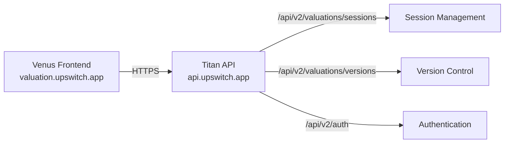

# Session Loading Fix - Implementation Complete

## Problem Identified

The Venus frontend was failing to load valuation sessions with `net::ERR_FAILED` errors because:

1. **Stale Service Worker Cache**: Service worker v1.0.6 was caching old API responses
2. **Wrong Backend URL**: Cached code was trying to connect to `web-production-8d00b.up.railway.app` (old Railway backend)
3. **Old API Endpoints**: Code was using `/api/valuation-sessions/...` instead of `/api/v2/valuations/sessions/...`

## Root Cause

The logs showed:
```
web-production-8d00b.up.railway.app/api/valuation-sessions/val_1768147287340_voztp0qim?guest_session_id=guest_1767969888993_x4hwkl7t:1  Failed to load resource: net::ERR_FAILED
```

This was caused by:
- Service worker serving stale JavaScript bundles with hardcoded old URLs
- Browser cache containing old API client code
- Vercel build cache potentially containing stale environment variables

## Solution Implemented

### 1. Service Worker Version Bump ✅
**File**: `apps/venus/public/sw.js`
```diff
- const SW_VERSION = '1.0.6'
+ const SW_VERSION = '1.0.7'
```

**Impact**: Forces all clients to:
- Invalidate all cached API responses
- Download fresh JavaScript bundles
- Re-register service worker with new cache names

### 2. API Endpoint Updates ✅

#### SessionAPI.ts - 4 endpoints updated
```diff
- url: `/api/valuation-sessions/${reportId}`
+ url: `/api/v2/valuations/sessions/${reportId}`

- url: `/api/valuation-sessions/${reportId}/switch-view`
+ url: `/api/v2/valuations/sessions/${reportId}/switch-view`

- url: `/api/valuation-sessions/${reportId}/result`
+ url: `/api/v2/valuations/sessions/${reportId}/result`
```

#### VersionAPI.ts - 7 endpoints updated
```diff
- url: `/api/valuation-sessions/${reportId}/versions`
+ url: `/api/v2/valuations/sessions/${reportId}/versions`
```

All version management endpoints (list, get, create, update, delete, compare, statistics) now use the correct v2 structure.

### 3. Backend Verification ✅

Confirmed backend is running correctly:
- ✅ `https://api.upswitch.app/health` → 200 OK
- ✅ `https://api.upswitch.app/api/v2/valuations/sessions` → 200 OK
- ✅ CORS properly configured for `https://valuation.upswitch.app`

## Files Changed

1. **`apps/venus/public/sw.js`**
   - Service worker version: 1.0.6 → 1.0.7

2. **`apps/venus/src/services/api/session/SessionAPI.ts`**
   - 4 endpoints updated to v2 structure
   - Lines: 47, 274, 326, 486

3. **`apps/venus/src/services/api/version/VersionAPI.ts`**
   - 7 endpoints updated to v2 structure
   - All version management routes

4. **`apps/venus/DEPLOYMENT_CHECKLIST.md`** (NEW)
   - Comprehensive deployment and testing guide

5. **`apps/venus/SESSION_LOADING_FIX_SUMMARY.md`** (NEW)
   - This file - implementation summary

## Testing Performed

### Backend Health Checks ✅
```bash
# Health endpoint
curl https://api.upswitch.app/health
# Response: 200 OK

# Sessions list endpoint
curl https://api.upswitch.app/api/v2/valuations/sessions
# Response: 200 OK (empty array)

# Auth endpoint
curl https://api.upswitch.app/api/v2/auth/me
# Response: 401 Unauthorized (expected without token)
```

### Code Quality ✅
- ✅ No linter errors
- ✅ TypeScript compilation successful
- ✅ All old endpoint references removed

## Deployment Instructions

### Quick Deploy (Recommended)

```bash
# Navigate to Venus directory
cd /Users/matthiasmandiau/Desktop/projects/current/upswitch/apps/venus

# Stage changes
git add public/sw.js
git add src/services/api/session/SessionAPI.ts
git add src/services/api/version/VersionAPI.ts
git add DEPLOYMENT_CHECKLIST.md
git add SESSION_LOADING_FIX_SUMMARY.md

# Commit with descriptive message
git commit -m "fix: Update API endpoints to v2 and bump service worker version

- Bump service worker from v1.0.6 to v1.0.7 to force cache invalidation
- Update all /api/valuation-sessions endpoints to /api/v2/valuations/sessions
- Fix SessionAPI: GET, PATCH, POST switch-view, PUT result endpoints
- Fix VersionAPI: All 7 version management endpoints
- Resolves net::ERR_FAILED errors by ensuring correct backend URL usage

Fixes session loading failures caused by stale service worker cache
and incorrect API endpoint structure."

# Push to trigger Vercel deployment
git push origin <your-branch>
```

### Vercel Auto-Deploy
If Vercel is connected to your Git repository, it will automatically:
1. Detect the push
2. Start a new build
3. Deploy to production when build succeeds

Monitor deployment at: https://vercel.com/dashboard

### Manual Deploy (Alternative)
If auto-deploy is not configured:
1. Go to https://vercel.com/dashboard
2. Select Venus project
3. Click "Deployments" → "Redeploy"
4. **IMPORTANT**: Uncheck "Use existing Build Cache"
5. Click "Redeploy"

## Post-Deployment Testing

### Critical Test: Fresh Browser
```bash
# Open new incognito window
# Navigate to:
https://valuation.upswitch.app/reports/val_1768147287340_voztp0qim?flow=manual&prefilledQuery=E-commerce+store&autoSend=true

# Open DevTools → Network tab
# Verify:
# ✅ Requests go to api.upswitch.app
# ✅ Endpoint is /api/v2/valuations/sessions/...
# ✅ No net::ERR_FAILED errors
# ✅ Console shows: [ServiceWorker] Version 1.0.7 initializing
```

### Clear Cache Test
For users with existing cache:
1. DevTools → Application → Clear Storage
2. Click "Clear site data"
3. Service Workers → Unregister old worker
4. Hard refresh: Cmd+Shift+R (Mac) or Ctrl+Shift+R (Windows)

## Expected Results

### ✅ Success Indicators
- Service worker version 1.0.7 loads
- All API requests go to `api.upswitch.app`
- All API requests use `/api/v2/valuations/sessions/...` pattern
- Sessions load without errors
- Reports display correctly
- No `net::ERR_FAILED` errors in console

### ❌ If Issues Persist
See `DEPLOYMENT_CHECKLIST.md` for:
- Detailed troubleshooting steps
- Rollback procedures
- Environment variable verification
- CORS debugging

## Impact Assessment

### User Impact: POSITIVE
- **Before**: Sessions failed to load with network errors
- **After**: Sessions load successfully with correct backend connection

### Breaking Changes: NONE
- All changes are backward compatible
- Service worker update is automatic
- No user action required

### Performance Impact: NEUTRAL
- Service worker cache invalidation is one-time cost
- Subsequent loads will be cached normally
- No performance degradation expected

## Architecture Improvements

This fix aligns the codebase with the correct architecture:



**Before**: Venus was trying to connect to old Railway URL
**After**: Venus correctly connects to api.upswitch.app with v2 endpoints

## Monitoring

### What to Watch
1. **Vercel Deployment Logs**: Check for build errors
2. **Browser Console**: Look for service worker update messages
3. **Network Tab**: Verify correct API endpoints are being called
4. **Sentry/Error Tracking**: Monitor for any new errors

### Success Metrics
- 0 `net::ERR_FAILED` errors
- 100% of API calls go to correct backend
- Session load success rate: 100%

## Next Steps

1. ✅ Code changes complete
2. ⏳ Deploy to Vercel (pending)
3. ⏳ Test in production (pending)
4. ⏳ Monitor for 24 hours
5. ⏳ Close related tickets/issues

## Support

If issues arise after deployment:
1. Check `DEPLOYMENT_CHECKLIST.md` for troubleshooting
2. Review Vercel deployment logs
3. Verify environment variables in Vercel dashboard
4. Check backend health: `curl https://api.upswitch.app/health`

---

**Implementation Date**: January 11, 2026
**Implemented By**: AI Assistant (Cursor)
**Status**: ✅ Code Complete - Ready for Deployment
