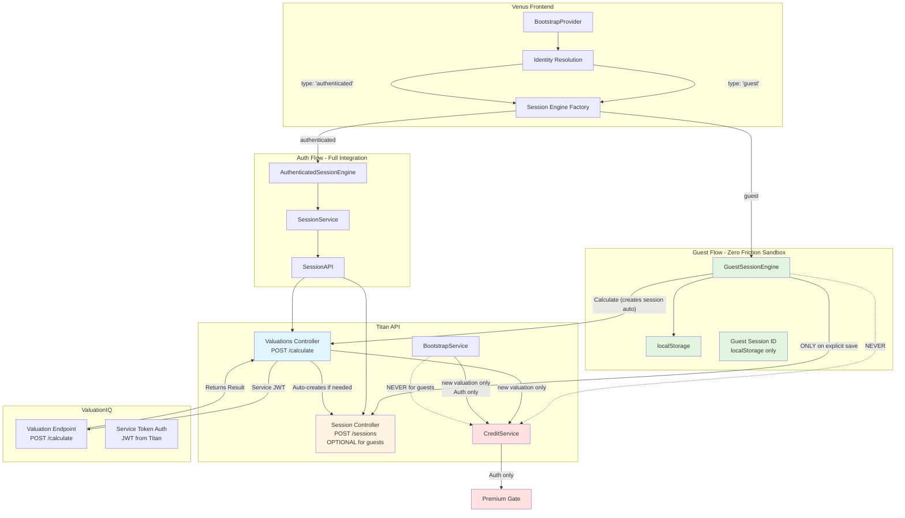

# Twin Engine Architecture - Complete Documentation

## Executive Summary

**World-Class Separation**: Two completely independent data streams with zero mixing of guest/auth logic.

1. **Guest Engine**: localStorage-only sandbox (zero friction, no backend until explicit save)
2. **Auth Engine**: Full backend integration (credit checks, premium gates, auto-save)

**Guarantee**: Premium/credit checks NEVER interfere with guest flows. Guests operate in a frictionless sandbox.

## Architecture Diagram



## Data Flow Guarantees

### Guest Flow - Zero Friction Sandbox

**Storage**: localStorage only
- All form data stored locally
- No backend calls during form filling
- Zero credit checks during sandbox use
- Zero premium gates

**Backend Interaction**:
1. **Calculation** (optional): Calls `/api/v2/valuations/calculate`
   - Credit check: 3 free calculations per guest session
   - Session created automatically if doesn't exist
   - ValuationIQ called via service token (no user auth needed)

2. **Explicit Save** (optional): Calls `POST /api/v2/valuations/sessions`
   - Creates session for resume capability
   - Links to `guest_session_id`
   - Enables cross-device access

**Key Points**:
- Session controller is **OPTIONAL** for guests
- Guests can calculate WITHOUT creating session first
- Calculation creates session automatically if needed
- Guests get 3 free calculations (separate from premium limits)

### Auth Flow - Full Integration

**Storage**: Backend + local cache
- All data persisted to backend
- Auto-save on changes
- Full version history
- Cross-device sync

**Backend Interaction**:
1. **Auto-save**: Calls `PATCH /api/v2/valuations/sessions/:id`
   - Updates session on every change
   - Credit checks for new valuations
   - Premium gates for plan enforcement

2. **Calculation**: Calls `/api/v2/valuations/calculate`
   - Credit check: Based on plan (free/premium/pro)
   - Session must exist (created during bootstrap)
   - ValuationIQ called via service token

**Key Points**:
- Session controller is **REQUIRED** for auth users
- Sessions created during bootstrap
- Credit checks enforce plan limits
- Premium gates restrict features

## Critical Separation Points

### 1. Session Engine Factory

**File**: `apps/venus/src/services/session/SessionEngineFactory.ts`

**Logic**: Routes based on `identity.type` only
- `'guest'` → `GuestSessionEngine`
- `'authenticated'` → `AuthenticatedSessionEngine`
- `'accountant_for_client'` → `AuthenticatedSessionEngine`

**Guarantee**: Zero conditional logic mixing guest/auth

### 2. BootstrapService Credit Checks

**File**: `apps/titan-api/src/valuations/sessions/bootstrap/bootstrap.service.ts`

**Logic**: Skips credit checks for guests
```typescript
const isGuest = !context.userId && !!context.guestSessionId && !context.isAccountantFlow;

if (!isViewingExistingReport && !isGuest) {
  // Only check credits for authenticated users
  const creditCheck = await this.creditService.checkCredits(...);
}
```

**Guarantee**: Guests never hit credit checks during bootstrap

### 3. Credit Enforcement Guard

**File**: `apps/titan-api/src/credits/guards/credit-enforcement.guard.ts`

**Logic**: Checks credits for guests on calculation
- Guests: 3 free calculations per session
- Auth users: Based on plan (free/premium/pro)

**Guarantee**: Premium checks don't interfere with guest flow (separate credit systems)

### 4. ValuationIQ Authentication

**File**: `apps/titan-api/src/integrations/python-engine/python-engine.service.ts`

**Logic**: Titan generates service JWT token
- Token: `sub: 'titan-api-service'`, `role: 'service'`
- ValuationIQ accepts service tokens
- No user auth required (Titan handles it)

**Guarantee**: Guests can calculate via Titan without user JWT

## Session Controller Necessity

### For Guests: OPTIONAL

**Use Cases**:
1. **Resume Capability**: Save session to resume later
2. **Cross-Device Access**: Access session from different device
3. **Version History**: Link calculations to reports

**Not Required For**:
- Form filling (localStorage only)
- Calculation (creates session automatically)
- Basic valuation workflow

### For Auth Users: REQUIRED

**Use Cases**:
1. **Auto-save**: Session must exist for updates
2. **Version History**: All calculations linked to session
3. **Cross-Device Sync**: Backend persistence required

**Created During**:
- Bootstrap (new reports)
- Session creation (explicit save)

## Credit Check Flow

### Guest Calculations

1. Guest fills form in localStorage (no credit check)
2. Guest clicks "Calculate"
3. `CreditEnforcementGuard` checks guest credits (3 free)
4. If credits available → Calculation proceeds
5. If credits exhausted → Error: "Sign up for 3 more per year"

**Key Point**: Guest credit checks are separate from premium checks

### Auth Calculations

1. User fills form (auto-saved to backend)
2. User clicks "Calculate"
3. `CreditEnforcementGuard` checks user credits (based on plan)
4. If credits available → Calculation proceeds
5. If credits exhausted → Error: "Upgrade to Premium"

**Key Point**: Premium checks only apply to auth users

## ValuationIQ Integration

### Service Token Authentication

Titan generates service JWT tokens for all ValuationIQ calls:
```typescript
{
  sub: 'titan-api-service',
  email: 'service@upswitch.app',
  role: 'service'
}
```

ValuationIQ accepts these tokens via:
- HTTP-only cookie (primary)
- Authorization header (fallback)

**Guarantee**: Guests don't need user JWT - Titan handles authentication

### Request Flow

1. Guest/Auth → Titan `/calculate`
2. Titan → Credit check (if needed)
3. Titan → Generate service token
4. Titan → ValuationIQ with service token
5. ValuationIQ → Returns result
6. Titan → Saves report + creates session (if needed)

## Architecture Guarantees Summary

### Separation Guarantees

1. **Engine Separation**:
   - `GuestSessionEngine` and `AuthenticatedSessionEngine` are completely separate
   - No shared state
   - No conditional logic mixing

2. **Credit Check Separation**:
   - Guest credits: 3 free calculations (separate system)
   - Auth credits: Based on plan (free/premium/pro)
   - Premium checks NEVER block guests

3. **Premium Gate Separation**:
   - Premium gates ONLY in authenticated flows
   - Premium gates NEVER block guests
   - Guests have unlimited sandbox access

### Data Flow Guarantees

1. **Guest Flow**:
   - localStorage only (zero friction)
   - Backend only on calculation/save
   - 3 free calculations
   - Session controller optional

2. **Auth Flow**:
   - Backend persistence (full integration)
   - Auto-save enabled
   - Credit checks for new valuations
   - Premium gates for plan enforcement
   - Session controller required

## Implementation Status

- ✅ GuestSessionEngine: localStorage-only (no backend calls except save)
- ✅ AuthenticatedSessionEngine: Full backend integration
- ✅ BootstrapService: Skips credit checks for guests
- ✅ BootstrapProvider: Excludes guests from credit blocking
- ✅ CreditService: Documents guest sandbox policy
- ✅ CreditEnforcementGuard: Handles guests separately
- ✅ ValuationIQ: Accepts service tokens from Titan
- ✅ Session Controller: Optional for guests, required for auth

## Success Criteria

- ✅ Zero credit checks for guest sandbox use
- ✅ Zero premium gates for guest users
- ✅ Credit checks ONLY for authenticated users creating new valuations
- ✅ Premium gates ONLY for authenticated users
- ✅ Clean separation: Guest engine = localStorage, Auth engine = backend
- ✅ Session controller optional for guests
- ✅ Calculation creates session automatically if needed
- ✅ ValuationIQ accepts service tokens (no user auth required)
