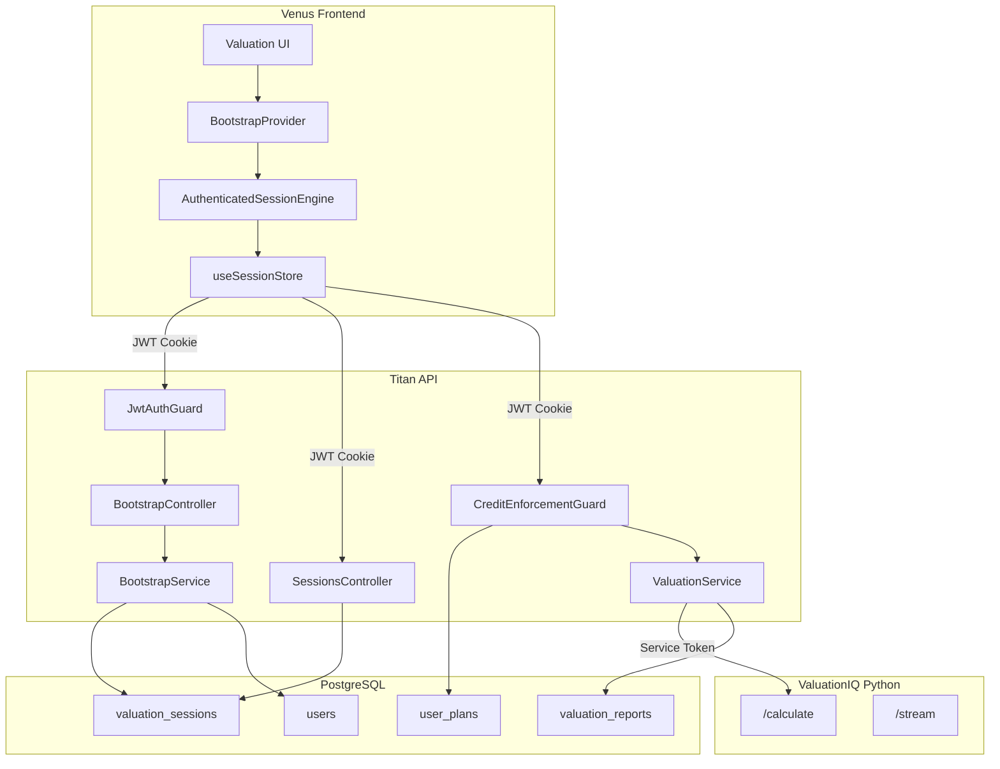

# AUTH-FIRST Architecture

## Overview

The Upswitch valuation platform uses an **AUTH-FIRST** architecture where all users must be authenticated before accessing valuation features. This document describes the complete data flow and separation guarantees.

## Architecture Diagram



## Key Principles

### 1. All Users Must Authenticate

- **JwtAuthGuard** protects all valuation endpoints
- No anonymous/guest access to valuation features
- Authentication via HTTP-only JWT cookie

### 2. Single Session Engine

- Only `AuthenticatedSessionEngine` is used
- All session operations go through Titan API
- Sessions stored in PostgreSQL for persistence

### 3. Clean Credit Enforcement

- Credits checked only for authenticated users
- No guest credit logic
- Premium/Pro users have unlimited access
- Free users have annual credit limits

## Data Flow

### Bootstrap Flow

1. User navigates to `/reports/val_xxx`
2. `BootstrapProvider` calls Titan `/api/v2/valuations/sessions/bootstrap`
3. `JwtAuthGuard` validates JWT cookie
4. `BootstrapService` fetches/creates session
5. Returns: identity, report, prefill, ui hints

### Valuation Calculation Flow

1. User submits valuation form
2. `AuthenticatedSessionEngine` calls Titan `/api/v2/valuations/calculate`
3. `JwtAuthGuard` validates authentication
4. `CreditEnforcementGuard` checks credits
5. `ValuationService` calls ValuationIQ with service token
6. Results saved to PostgreSQL
7. Response returned to frontend

## User Types

| Type | Description | Credit Policy |
|------|-------------|---------------|
| `authenticated` | Direct user access | Annual credit limit (free) or unlimited (premium) |
| `accountant_for_client` | Accountant acting on behalf of client | First valuation free, then client needs premium |

## Header Format

### Authentication
```
Cookie: access_token=<JWT>
```

### Client Context (Accountant Flow)
```
X-Client-User-Id: <client_user_uuid>
X-Accountant-User-Id: <accountant_user_uuid>
X-Relationship-Id: <accountant_customers_uuid>
```

## Session Controller Purpose

The session controller is essential for AUTH-FIRST:

| Feature | Description |
|---------|-------------|
| **Persistence** | Stores session_data in PostgreSQL |
| **Report Linking** | Links sessions to valuation_reports |
| **Version History** | Enables version tracking |
| **Cross-Device** | User can continue on different device |
| **Accountant Flow** | Accountant accesses client sessions |

## Separation Guarantees

| Concern | Guarantee |
|---------|-----------|
| Authentication | JwtAuthGuard on all endpoints |
| Credit Checks | Only for authenticated users |
| Premium Gates | Only for users hitting limits |
| Accountant Flow | Clean via X-Client-Context-* headers |
| Session Ownership | Verified by userId or client context |

## Migration Notes

The following guest-related features have been removed:
- `GuestSessionEngine`
- `guestSessionId` in DTOs
- `X-Guest-Session-Id` header
- Guest credit tracking
- `migrateGuestCredits()` function

Users are now redirected to login before accessing valuation features.
