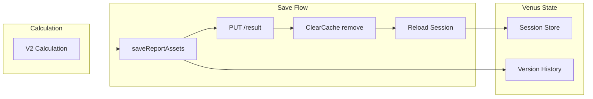

# V2 Creation: Version and Assets Behavior

**Status**: Reference documentation  
**Date**: March 2026  
**Topic**: What happens when creating version 2 (V2) of a valuation report

---

## Overview

When you create V2 (by recalculating with significant changes), two things happen:

1. **Version creation is additive** – V2 is added to the version history; V1 is preserved.
2. **Current assets in Venus are replaced** – The session and cache for that report are updated with V2's data.

---

## 1. New Version Is Created (Additive)

V2 is **added** to the version history; V1 is **not** removed.

### Venus

- **File**: `apps/venus/src/components/ValuationForm/hooks/useValuationFormSubmission.ts` (lines 377–425)
- **Behavior**: Calls `createVersion()` when there are significant changes between the previous version and the new calculation.
- **Flow**: After calculation completes, `fetchVersions()` syncs from backend, then `createVersion()` is called with the new result.

### Titan

- **File**: `apps/titan-api/src/valuations/valuations.service.ts`
- **Behavior**: Calls `createVersionOnRecalculation()` during the calculation flow.
- **File**: `apps/titan-api/src/valuations/versions/services/version.service.ts`
- **Behavior**: Creates a new version record and marks the previous version as inactive.

### Version History

- V1 is marked **inactive**; V2 is **active**.
- Both remain in the version history.
- Users can switch between versions via the version dropdown.

---

## 2. Current Assets in Venus Are Replaced

The **current** session state and cache for that report are updated to V2's data.

### Flow

1. After calculation, `saveReportAssets()` is called with the new result (V2).
2. **Backend**: `PUT /api/v2/valuations/sessions/:id/result` updates the session with V2's valuation result, HTML report, and session data.
3. **Cache update** (see [ReportAssetService.ts](../../src/services/report/ReportAssetService.ts)):
   - The authoritative `PUT /result` session is written directly into the cache when Titan returns it.
   - If a reload is needed, the previous cache entry is kept until a fresh replacement is available.
   - Fresh session data (with V2 data) is stored in the cache and session store.

So the **current** session and cache are replaced with V2's data.

---

## 3. Version History vs. Current State

| Aspect               | Behavior                                               |
| -------------------- | ------------------------------------------------------ |
| **Version history**  | V1 and V2 both exist. You can switch between them.     |
| **Current session**  | Holds V2's data (valuation result, HTML report).       |
| **Session cache**    | Cleared for that reportId, then reloaded with V2 data. |
| **Displayed report** | Shows V2's report until you restore another version.   |

---

## 4. Summary

- **Create new version?** Yes. V2 is added; V1 is preserved in history.
- **Replace all assets in Venus?** Yes. The current session and cache for that report are updated to V2's data.

V1 is not lost; it is only no longer the active view. You can restore it from the version history.

---

## Data Flow Diagram

---

## Related Documentation

- [Version Dropdown Implementation](./VERSION_DROPDOWN_IMPLEMENTATION.md)
- [Versioning API Spec](./api/VERSIONING_API_SPEC.md)
- [MA Workflow Architecture](./architecture/MA_WORKFLOW_ARCHITECTURE.md)
