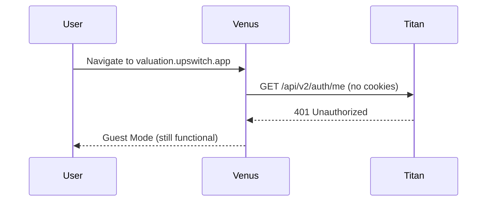
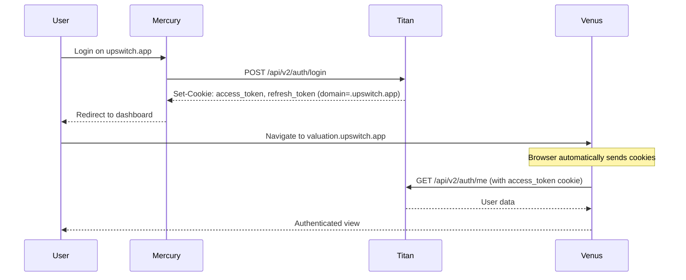
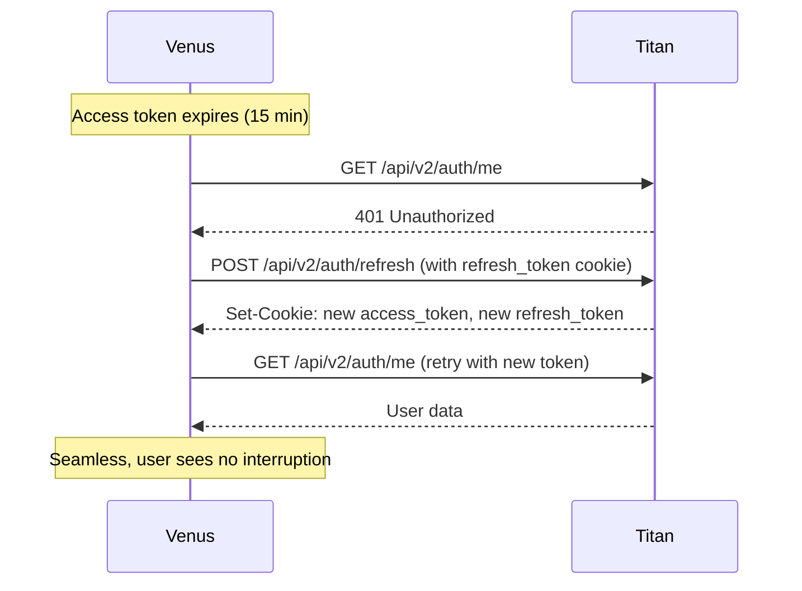
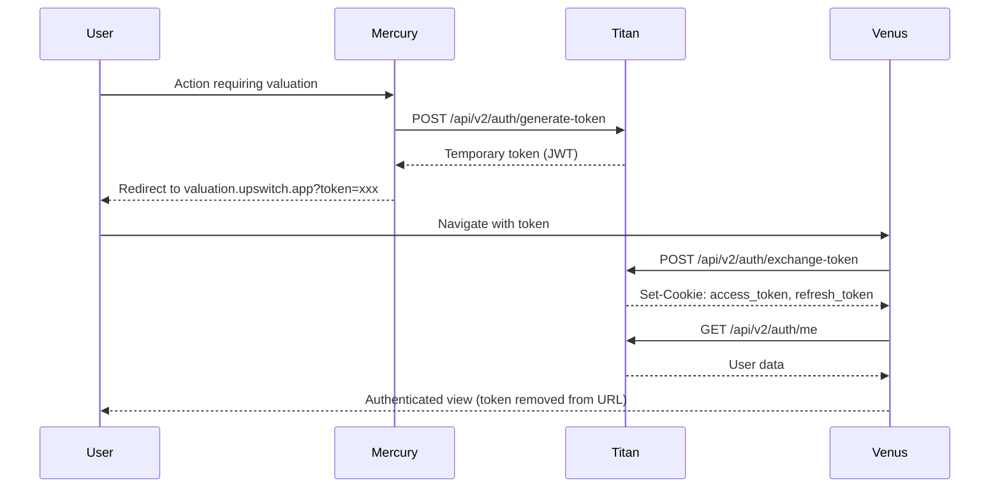

# Venus Authentication Architecture

## Overview

Venus (Valuation Tester) is a Next.js 13 application running on the subdomain `valuation.upswitch.app`. It integrates with Mercury (main app) and Titan (backend API) using a cross-subdomain authentication system with HTTP-only cookies.

**Port**: 3001  
**Domain**: valuation.upswitch.app  
**Stack**: Next.js 13.5.6, React, Zustand, Axios

## Dual-Token Authentication System

### Token Types

Venus uses a dual-token system managed by Titan API:

1. **Access Token** (`upswitch_access_token`)
   - **Lifespan**: 15 minutes
   - **Purpose**: Authenticate API requests
   - **Storage**: HTTP-only cookie
   - **Domain**: `.upswitch.app` (cross-subdomain)
   - **Refreshed**: Automatically every 5 minutes or on-demand

2. **Refresh Token** (`upswitch_refresh_token`)
   - **Lifespan**: 7 days
   - **Purpose**: Obtain new access tokens
   - **Storage**: HTTP-only cookie
   - **Domain**: `.upswitch.app` (cross-subdomain)
   - **Rotation**: New refresh token issued on each refresh

### Cookie Configuration

Both tokens are set with the following attributes:

```typescript
{
  httpOnly: true,        // Not accessible via JavaScript
  secure: true,          // HTTPS only (production)
  sameSite: 'lax',       // CSRF protection
  domain: '.upswitch.app', // Shared across subdomains
  path: '/',
}
```

## Authentication Flows

### 1. Direct Navigation to Venus (No Login)



**Result**: User can use Venus with guest session (data saved with guest_session_id)

### 2. Login on Mercury → Navigate to Venus



**Result**: User is automatically authenticated on Venus without re-login

### 3. Token Refresh (Automatic)



**Result**: User stays authenticated without interruption

### 4. Token Exchange Flow (Subdomain Handoff)



**Result**: User is handed off from Mercury to Venus with authentication preserved

## Implementation Details

### 1. Auth Store (`src/lib/auth.ts`)

Zustand store managing authentication state:

```typescript
interface AuthState {
  user: User | null
  loading: boolean
  error: string | null
  
  checkSession: () => Promise<User | null>
  exchangeToken: (token: string) => Promise<User | null>
  logout: () => Promise<void>
}
```

**Key Features**:
- Automatic token refresh on 401 responses
- Guest session migration when user logs in
- Silent error handling (guest mode fallback)

### 2. Token Refresh Hook (`src/hooks/useTokenRefresh.ts`)

Proactive token refresh to prevent expiration:

```typescript
const CHECK_INTERVAL = 5 * 60 * 1000 // 5 minutes
```

**Strategy**:
- Checks every 5 minutes (before 15-minute access token expires)
- Exponential backoff on errors (1s, 2s, 4s)
- Rate limiting: max 1 refresh per minute
- Tab synchronization via broadcast channel

### 3. HTTP Client (`src/services/api/HttpClient.ts`)

Axios instance with automatic cookie handling:

```typescript
axios.create({
  baseURL: process.env.NEXT_PUBLIC_API_BASE_URL,
  withCredentials: true, // CRITICAL: Send cookies automatically
  timeout: 90000,
})
```

**Features**:
- Automatically includes cookies in all requests
- Guest session tracking for unauthenticated users
- Request timeout and cancellation management

## Cross-Subdomain Cookie Sharing

### How It Works

1. **Cookie Domain**: `.upswitch.app` (note the leading dot)
   - Mercury sets cookies on `.upswitch.app`
   - Venus reads cookies from `.upswitch.app`
   - Browser automatically sends cookies to all subdomains

2. **Browser Behavior**:
   - When navigating from `upswitch.app` → `valuation.upswitch.app`, cookies are preserved
   - No JavaScript cookie access needed (HTTP-only)
   - Browser handles cookie transmission automatically

3. **Local Development**:
   - Use `COOKIE_DOMAIN=localhost` (no subdomain sharing)
   - Or use hosts file to simulate subdomains:
     ```
     127.0.0.1 local.upswitch.app
     127.0.0.1 valuation.local.upswitch.app
     ```

## Guest Session Handling

Venus supports unauthenticated users through guest sessions:

### Guest Flow

1. User navigates to Venus without logging in
2. Venus generates `guest_session_id` (stored in localStorage)
3. All API requests include `x-guest-session-id` header
4. Titan saves valuation reports with `guest_session_id`

### Guest → Authenticated Migration

When a guest user logs in:

1. Venus detects authenticated user
2. Calls Titan `/api/v2/valuation/migrate-guest-data`
3. Titan moves all guest reports to user account
4. Venus clears guest session ID
5. User sees all their previous work

**Code Location**: `src/lib/auth.ts` (lines 95-116)

## Environment Variables

### Production

```bash
NEXT_PUBLIC_BACKEND_URL=https://api.upswitch.app
NEXT_PUBLIC_API_BASE_URL=https://api.upswitch.app
COOKIE_DOMAIN=.upswitch.app
```

### Local Development

```bash
NEXT_PUBLIC_BACKEND_URL=http://localhost:8080
NEXT_PUBLIC_API_BASE_URL=http://localhost:8080
COOKIE_DOMAIN=localhost
```

### Compatibility

Venus supports both `VITE_` and `NEXT_PUBLIC_` prefixes via `src/utils/env.ts`:

```typescript
VITE_BACKEND_URL → NEXT_PUBLIC_BACKEND_URL
VITE_API_BASE_URL → NEXT_PUBLIC_API_BASE_URL
```

This ensures backward compatibility during migration.

## Testing

### E2E Tests

Location: `e2e/auth-cross-subdomain.spec.ts`

**Test Scenarios**:
1. ✅ Login on Mercury → Navigate to Venus → Verify authenticated
2. ✅ Guest mode when not logged in
3. ✅ Token exchange flow with `?token=xxx`
4. ✅ Authentication persists across page reloads
5. ✅ Automatic token refresh on access token expiration

**Run Tests**:
```bash
npm run test:e2e
```

### Manual Testing Checklist

- [ ] Login on Mercury (`upswitch.app`)
- [ ] Navigate to Venus (`valuation.upswitch.app`)
- [ ] Verify user info appears in UI
- [ ] Wait 5 minutes, verify token refresh happens
- [ ] Reload page, verify still authenticated
- [ ] Logout from Venus, verify cookies cleared
- [ ] Navigate to Venus without login, verify guest mode

## Troubleshooting

### Issue: Venus doesn't detect authentication from Mercury

**Symptoms**: User logged in on Mercury but Venus shows guest mode

**Causes & Solutions**:

1. **Cookie domain mismatch**
   - Check Titan sets cookies with `domain: '.upswitch.app'`
   - Verify environment variable `COOKIE_DOMAIN=.upswitch.app`

2. **CORS / withCredentials**
   - Ensure `withCredentials: true` in all API calls
   - Verify Titan CORS allows credentials from Venus origin

3. **HTTPS in production**
   - Cookies with `secure: true` require HTTPS
   - Local dev should use `secure: false`

4. **Browser blocking cookies**
   - Check browser settings (third-party cookies)
   - Clear browser cache and cookies
   - Test in incognito mode

### Issue: Token refresh fails

**Symptoms**: User logged out after 15 minutes

**Causes & Solutions**:

1. **Refresh token expired**
   - Refresh tokens last 7 days
   - User needs to re-login if expired

2. **Token refresh endpoint failing**
   - Check Titan `/api/v2/auth/refresh` endpoint
   - Verify refresh token cookie is being sent

3. **Rate limiting**
   - Venus limits refresh to once per minute
   - Check console for "Token refresh rate limited" message

### Issue: Guest session data not migrating

**Symptoms**: User logs in but previous valuation reports missing

**Causes & Solutions**:

1. **Migration API failing**
   - Check Titan `/api/v2/valuation/migrate-guest-data` endpoint
   - Verify `guest_session_id` is being sent in request

2. **Guest session ID cleared prematurely**
   - Migration happens in `checkSession()` and `exchangeToken()`
   - Check console for migration logs

## Security Considerations

### HTTP-Only Cookies

✅ **Why**: Prevents XSS attacks from stealing tokens  
✅ **Tradeoff**: JavaScript cannot read cookies (expected behavior)

### Cross-Subdomain Cookies

⚠️ **Risk**: All subdomains can read cookies  
✅ **Mitigation**: Only use `.upswitch.app` for trusted subdomains

### Token Rotation

✅ **Why**: Limits damage if refresh token is compromised  
✅ **Implementation**: New refresh token on every refresh call

### SameSite=Lax

✅ **Why**: CSRF protection (cookies not sent on cross-site requests)  
✅ **Works with**: Same-site navigation (upswitch.app → valuation.upswitch.app)

### Secure Flag

✅ **Production**: Cookies only sent over HTTPS  
⚠️ **Development**: Set to false for localhost

## Architecture Diagram

```mermaid
graph TB
    subgraph Mercury[Mercury - upswitch.app]
        M1[Login Form]
        M2[Dashboard]
    end

    subgraph Venus[Venus - valuation.upswitch.app]
        V1[Auth Store]
        V2[Token Refresh Hook]
        V3[HTTP Client]
        V4[Valuation UI]
    end

    subgraph Titan[Titan API - api.upswitch.app]
        T1[/api/v2/auth/login]
        T2[/api/v2/auth/me]
        T3[/api/v2/auth/refresh]
        T4[/api/v2/auth/logout]
    end

    subgraph Browser[Browser]
        C1[Cookies Store]
    end

    M1 -->|POST credentials| T1
    T1 -->|Set-Cookie| C1
    M2 -->|Navigate| V4
    V1 -->|GET with cookies| T2
    C1 -->|Auto-send cookies| T2
    V2 -->|POST refresh| T3
    T3 -->|Set-Cookie new tokens| C1
    V4 -->|POST logout| T4
    T4 -->|Clear cookies| C1
```

## API Endpoints Reference

### Titan Authentication Endpoints

| Endpoint | Method | Purpose | Cookies Sent | Cookies Set |
|----------|--------|---------|--------------|-------------|
| `/api/v2/auth/me` | GET | Get current user | access_token | - |
| `/api/v2/auth/refresh` | POST | Refresh tokens | refresh_token | access_token, refresh_token |
| `/api/v2/auth/logout` | POST | Clear session | access_token | Clear both tokens |
| `/api/v2/auth/exchange-token` | POST | Token handoff | - | access_token, refresh_token |

## Best Practices

1. **Always use `withCredentials: true`** in fetch/axios calls
2. **Never store tokens in localStorage** (use HTTP-only cookies)
3. **Handle 401 errors gracefully** (fallback to guest mode)
4. **Proactive token refresh** (don't wait for 401)
5. **Clear guest session after migration** (prevent duplicate tracking)
6. **Log auth events for debugging** (console.log in development)
7. **Test cross-subdomain flow thoroughly** (E2E tests)

## Migration Notes

### From Old System (upswitch_session)

**Old**: Single session cookie  
**New**: Dual-token system (access + refresh)

**Changes**:
- Cookie names changed: `upswitch_session` → `upswitch_access_token` + `upswitch_refresh_token`
- Endpoint updated: `/api/auth/me` → `/api/v2/auth/me`
- Automatic refresh logic added
- Token rotation implemented

**Backward Compatibility**: None. Users will need to re-login after deployment.

## Support

For issues or questions:
- **Technical Docs**: `/docs/architecture/`
- **Backend API**: Titan repository
- **Frontend App**: Mercury repository
- **E2E Tests**: `e2e/auth-cross-subdomain.spec.ts`

---

**Last Updated**: January 2026  
**Version**: 2.0 (Dual-Token System)  
**Author**: UpSwitch Engineering Team


