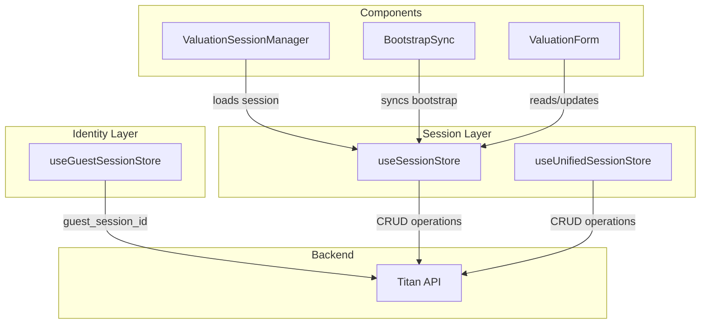

# Venus Session Stores Architecture

This document explains the relationship between the three session-related stores in Venus and when to use each one.

## Overview

Venus uses a multi-store architecture for session management to handle different aspects of the user experience:

| Store | Purpose | Scope |
|-------|---------|-------|
| `useSessionStore` | Main valuation session state | Per-report session data |
| `useUnifiedSessionStore` | Simplified session API (newer) | Backend session sync |
| `useGuestSessionStore` | Guest/anonymous session tracking | Cross-session identity |

---

## Store Details

### 1. `useSessionStore` (Primary - Use This)

**File**: `useSessionStore.ts`

**Purpose**: Main store for valuation session state. This is the primary store that components should use.

**When to Use**:
- Loading/saving valuation sessions
- Accessing current session data (company_name, financials, etc.)
- Tracking save state (isSaving, hasUnsavedChanges)
- Checking initialization status
- Plan enforcement (paywall handling)

**Key Features**:
- Promise cache prevents duplicate load calls
- Optimistic updates with localStorage cache
- Restoration progress tracking
- Debounced auto-save support
- Session data validation

**Example Usage**:

```typescript
import { useSessionStore } from '../store/useSessionStore'

function MyComponent() {
  // Subscribe to specific values (recommended)
  const session = useSessionStore((state) => state.session)
  const isLoading = useSessionStore((state) => state.isLoading)
  const loadSession = useSessionStore((state) => state.loadSession)
  
  useEffect(() => {
    if (reportId) {
      loadSession(reportId)
    }
  }, [reportId])
}
```

**State Shape**:
```typescript
interface SessionStore {
  session: ValuationSession | null
  isLoading: boolean
  error: string | null
  isSaving: boolean
  lastSaved: Date | null
  hasUnsavedChanges: boolean
  isInitializing: boolean
  restorationProgress: RestorationProgress | null
  paywallData: { current: number; limit: number; message: string } | null
}
```

---

### 2. `useUnifiedSessionStore` (Backend API Layer)

**File**: `useUnifiedSessionStore.ts`

**Purpose**: Simpler, more modern session store designed for direct backend API interaction. Uses the unified session API from Titan.

**When to Use**:
- Direct backend session CRUD operations
- When you need a simpler API without form-specific features
- Future features that need clean session management

**Key Features**:
- Persisted to localStorage via Zustand middleware
- Optimistic updates with rollback
- Cleaner, simpler API
- Type-safe session model

**Example Usage**:

```typescript
import { useUnifiedSessionStore, useSession } from '../store/useUnifiedSessionStore'

function MyComponent() {
  // Convenience hook
  const session = useSession()
  
  // Or full store access
  const { createSession, updateSession } = useUnifiedSessionStore()
  
  const handleCreate = async () => {
    const session = await createSession('valuation', { company_name: 'Test' })
  }
}
```

**State Shape**:
```typescript
interface SessionStore {
  session: Session | null
  isLoading: boolean
  error: string | null
  
  loadSession: (sessionKey: string) => Promise<void>
  createSession: (type?: string, data?: Record<string, any>) => Promise<Session>
  updateSession: (updates: Partial<Session>) => Promise<void>
  clearSession: () => void
}
```

**Relationship with `useSessionStore`**:
- `useUnifiedSessionStore` was designed as a simpler replacement
- Currently, `useSessionStore` is actively used by all components
- Future migration path: gradually move to `useUnifiedSessionStore`

---

### 3. `useGuestSessionStore` (Identity Layer)

**File**: `useGuestSessionStore.ts`

**Purpose**: Tracks guest session identity for anonymous users. This is **not** the valuation session - it's the user's anonymous identity.

**When to Use**:
- Getting the guest_session_id for API calls
- Initializing anonymous user sessions
- Clearing session on logout

**Key Features**:
- Automatic initialization on page load
- Promise caching prevents duplicate init requests
- Syncs with localStorage
- Skips creation for authenticated users

**Example Usage**:

```typescript
import { useGuestSessionStore } from '../store/useGuestSessionStore'

function MyComponent() {
  const { ensureSession, getSessionId, clearSession } = useGuestSessionStore()
  
  useEffect(() => {
    // Ensure guest session exists (for anonymous users only)
    ensureSession()
  }, [])
  
  // Get session ID synchronously (for interceptors)
  const guestId = getSessionId()
}
```

**State Shape**:
```typescript
interface GuestSessionState {
  sessionId: string | null
  expiresAt: string | null
  isInitialized: boolean
  isInitializing: boolean
  initializationPromise: Promise<string | null> | null
  
  initializeSession: () => Promise<string | null>
  getSessionId: () => string | null
  clearSession: () => void
  ensureSession: () => Promise<string | null>
}
```

**Important**: This store tracks the **user's identity**, not the valuation session. A guest user can create multiple valuation sessions, all linked to their `guest_session_id`.

---

## How They Work Together



### Flow for Different User Types

#### Authenticated User (Seller/Accountant)
1. Auth cookies sent with all requests
2. `useGuestSessionStore` skipped (returns null)
3. `useSessionStore` loads session by reportId
4. Session owned by `user_id`

#### Guest User
1. `useGuestSessionStore.ensureSession()` creates guest ID
2. `guest_session_id` sent as header with all requests
3. `useSessionStore` loads session by reportId
4. Session owned by `guest_session_id`

#### Accountant for Client (Mercury Flow)
1. `clientToken` exchanged for client context
2. Client context stored in `useClientContext` (separate store)
3. Headers include `X-Client-User-Id`, `X-Accountant-User-Id`
4. `useSessionStore` loads session owned by client's user_id

---

## Best Practices

### DO:
- Use `useSessionStore` for all valuation session operations
- Subscribe to specific values, not the entire store
- Use `useGuestSessionStore` only for getting guest_session_id
- Check `isInitializing` before showing forms

### DON'T:
- Mix `useSessionStore` and `useUnifiedSessionStore` in the same component
- Create new guest sessions for authenticated users
- Store UI state in session stores (use local state instead)
- Subscribe to entire store object (causes excessive re-renders)

---

## Migration Path

Currently, `useSessionStore` is the primary store. Future work may consolidate to `useUnifiedSessionStore`:

| Phase | Action |
|-------|--------|
| Now | Use `useSessionStore` for all session operations |
| Future | Gradually migrate features to `useUnifiedSessionStore` |
| Final | Deprecate `useSessionStore`, use `useUnifiedSessionStore` only |

---

## Related Files

- `src/services/session/SessionService.ts` - Service layer for session CRUD
- `src/lib/bootstrap/SessionBootstrapService.ts` - Bootstrap initialization
- `src/hooks/useBootstrapSync.ts` - Bridge between bootstrap and stores
- `src/stores/clientContext.ts` - Client context for accountant flow

---

## Troubleshooting

### Session not loading
1. Check if bootstrap completed (`useBootstrap().isBootstrapping`)
2. Check for errors in `useSessionStore().error`
3. Verify reportId matches session in store

### Duplicate API calls
1. Ensure components subscribe to specific values
2. Check that promise cache is working (logs show "reusing promise")
3. Verify `BootstrapSync` isn't triggering redundant loads

### Guest session issues
1. Check `localStorage` for `upswitch_guest_session_id`
2. Verify `ensureSession()` completes before API calls
3. Check if user became authenticated (guest session should be skipped)

---

**Last Updated**: January 2026
**Architecture Version**: 2.0 (Bootstrap-based)
