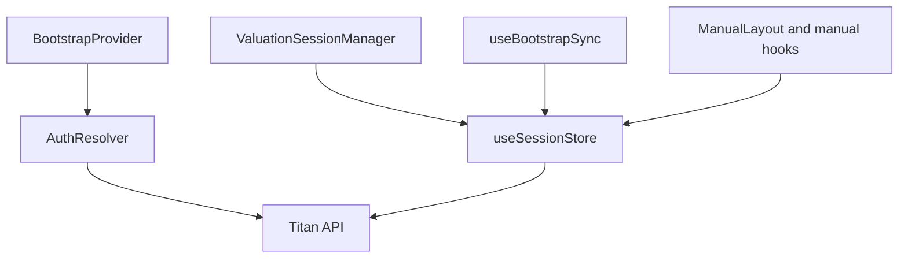

# Venus Session Store Architecture

Venus has one canonical valuation session store: `useSessionStore`.

## Auth-First Model

Guest sessions have been removed. `BootstrapProvider` resolves authenticated identity and report context before the report UI mounts, then `useSessionStore` owns valuation session state for the active report.

## Canonical Store

| Store | Purpose | Scope |
| --- | --- | --- |
| `useSessionStore` | Main valuation session state | Per-report session data, save state, restoration, and paywall state |

## When To Use `useSessionStore`

- Loading and saving valuation sessions.
- Reading current report/session data such as company name, financials, valuation result, and HTML report.
- Tracking save state and unsaved changes.
- Coordinating bootstrap/restoration readiness.
- Handling valuation-session paywall state.

Subscribe to specific values instead of the whole store object:

```typescript
import { useSessionStore } from '../store/useSessionStore'

function MyComponent({ reportId }: { reportId: string }) {
  const session = useSessionStore((state) => state.session)
  const isLoading = useSessionStore((state) => state.isLoading)
  const loadSession = useSessionStore((state) => state.loadSession)

  useEffect(() => {
    if (reportId) {
      void loadSession(reportId)
    }
  }, [loadSession, reportId])

  return null
}
```

## Data Flow



## Boundaries

- `BootstrapProvider` resolves identity and report bootstrap state.
- `ValuationSessionManager` controls report/session loading.
- `useSessionStore` owns the active valuation session state.
- `SessionService` and `SessionAPI` perform persistence.
- `useClientContext` carries accountant/client context separately from session state.

## Avoid

- Introducing a second session store.
- Persisting UI-only state in the session store.
- Calling session APIs directly from product components when a store/service boundary already exists.
- Subscribing to the entire store object in components.

## Related Files

- `src/store/useSessionStore.ts`
- `src/services/session/SessionService.ts`
- `src/services/api/session/SessionAPI.ts`
- `src/lib/bootstrap/SessionBootstrapService.ts`
- `src/hooks/useBootstrapSync.ts`
- `src/stores/clientContext.ts`
